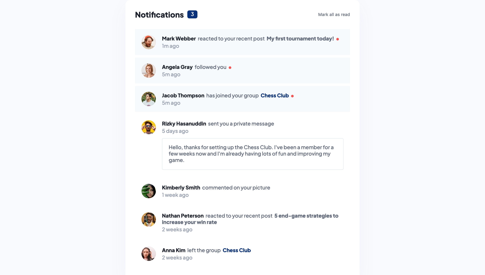

# Frontend Mentor - Notifications page solution

This is a solution to the [Notifications page challenge on Frontend Mentor](https://www.frontendmentor.io/challenges/notifications-page-DqK5QAmKbC). Frontend Mentor challenges help you improve your coding skills by building realistic projects. 

## Table of contents

- [Overview](#overview)
  - [The challenge](#the-challenge)
  - [Screenshot](#screenshot)
  - [Links](#links)
- [My process](#my-process)
  - [Built with](#built-with)
  - [What I learned](#what-i-learned)

## Overview

### The challenge

Users should be able to:

- Distinguish between "unread" and "read" notifications
- Select "Mark all as read" to toggle the visual state of the unread notifications and set the number of unread messages to zero
- View the optimal layout for the interface depending on their device's screen size
- See hover and focus states for all interactive elements on the page

### Screenshot

### Links

- Solution URL: [link](https://notifications-component.vercel.app)

## My process

### Built with

- React
- Parcel
- Flexbox
- CSS Modules

### What I learned

1. How to make React application from scratch using Parcel build tool
2. Enabling CSS nesting via Parcel CSS parser
3. Copying static files into build bundle via Parcel plugin [parcel-reporter-static-files-copy](https://github.com/elwin013/parcel-reporter-static-files-copy)
4. Composition of different UI elements inside component based on different variations of incoming data (e.g. NotificationItem component)
